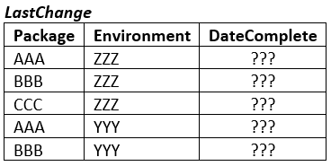

## SQL Challenge

### Get as far as you can with these four exercises

1.  Setup a SQLTest database on your SQL instance and setup 3 tables with data in them in this instance using one of these two methods:
    - OPTION 1: Execute the DACPAC into your local dev SQL instance to create the SQLTest database *note: you can run it repeatedly but it will recreate the database each time*
	- OPTION 2: Create the SQLTest database, then go to the "Tables" folder and execute each SQL to create the tables. Then go to the "PostDeploy" folder to insert the test data
    - **Include a screenshot of the completed database**
	
2.  Using the **Deploys** and the **Requests** tables, write a SQL script to find the package and environment table combination with the most recent **DateComplete** and update the LastChange table's DateComplete using SQL:
    - 
    - **Include the script if completed**

3.  Build the DACPAC into a *.dacpac file and use command-line sqlpackage to use the SQLTest.publish.xml file to publish to your local database
    - **Include the dacpac file and the full command used in your cmd publish**
	
4.  What is wrong with the database design? Think through how it's laid out and send back either an idea of what could be done or even better, fix it!
    - **OPTION 1: Update the dacpac and send the dacpac back with your desired changes**
	- **OPTION 2: Update/add files to the tables and postdeploy folders and return the files in those folders with your desired changes**
	- **OPTION 3: Just write back and say what you think would make the database better**